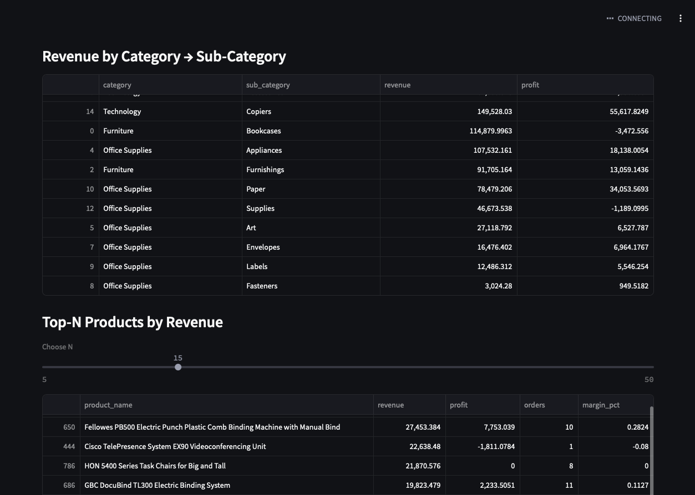

📊 Sales Analytics Dashboard
An interactive Streamlit dashboard that turns raw sales data into executive level insights. Built with python, pandas, matplotlib, and Streamlit. 
**Live demo:** https://raj-singh005-sales-analytics-dashboard-app-cndotl.streamlit.app/
 Features
- KPIs: Revenue, Profit, Margin %, AOV, Orders per Customer, Weighted Discount %
- Monthly trends: Revenue & Profit with 3-month moving average + naïve forecast
- Drilldowns: Category → Sub-Category breakdown and Top-N products
- Customer cohorts: Retention analysis with heatmap (counts + rates)
- Auto-Insights: Generates simple narrative takeaways
- Filters: Date range, Region, Segment
- Data Quality Panel: Shape, dtypes, missing values

Screenshots
![KPI's] (docs/kpis.png)

 Tech Stack
- Python (pandas, numpy, matplotlib)
- Streamlit for UI
- GitHub for portfolio hosting
